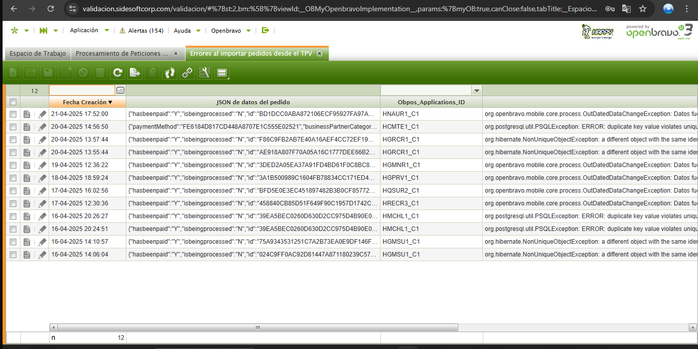

# Proceso para limpiar la tabla Errores de Tipo de TPV

* [http://open.sidesoftcorp.com:8082/projects/implementacion-openbravo-happy/work\_packages/15561/activity](http://open.sidesoftcorp.com:8082/projects/implementacion-openbravo-happy/work_packages/15561/activity)

Se solicita revisar si existe un proceso propio del Core del Openbravo

En donde se identifica lo siguiente:

&#x20;Actualmente existe una ventana denominada **Log Clean Up Configuration** nativa del modulo denominado **org.openbravo.utility.cleanup.log**

el cual se encarga de eliminar los registros de tablas en un determinado periodo de tiempo siendo los siguientes campos a detallar a continuación sus parámetros a considerar al momento de realizar su configuración

Dicha ventana se encuentra al momento de ingresar al sistema como modo administrador&#x20;

<figure><figcaption></figcaption></figure>

* **Log Table:** Tabla de la cual se quiere eliminar los registros en el lapso de tiempo definido
* **Older Than Days:** En este caso funciona como los días que el usuario espera antes de realizar la eliminación de los datos a la fecha actual
* **Date Column to Check:** Columna con la que se quiere comparar la fecha actual menos los días obtenidos de (Older Than Days)

\------------------------------------------------------------------------------------------

**Datos de la configuracion Implementada para las pruebas**

* **Log Table:** OBPOS\_Errors
* **Older Than Days:** 7
* **Date Column to Check:** Created

Un ejemplo practico se presenta en el siguiente JQuery

Obteniendo un JQuery similar al siguiente para realizar la accion del borrado de la información

```
delete from OBPOS_Errors where creationDate < now() - 23 and client.id = 'A68042BC36714DDBB80EF2DF265CB509'
```

En donde se resta la fecha actual contra los dias obtenidos de la ventana mencionada

Teniendo una operacion similar a la siguiente expresion

* V1=(2024-04-23)-7 = 2024-04-16

Con esto se define que a partir del 2024-04-16  los datos que tengan una fecha menor en la columna fecha de creacion se veran afectados en este caso eliminados como se muestra a continuacion&#x20;

<figure><figcaption><p>Sin Cambio</p></figcaption></figure>

<figure><figcaption><p>Con Cambio</p></figcaption></figure>

Para Ejecutar los combios añadidos ejecutar el proceso denominado **Log Clean Up Process**

<figure><figcaption></figcaption></figure>

Esta opcion esta pensaba para aquellas tablas que no son de tipo transaccionales es decir que guarden relacion con un o multiples registros&#x20;
